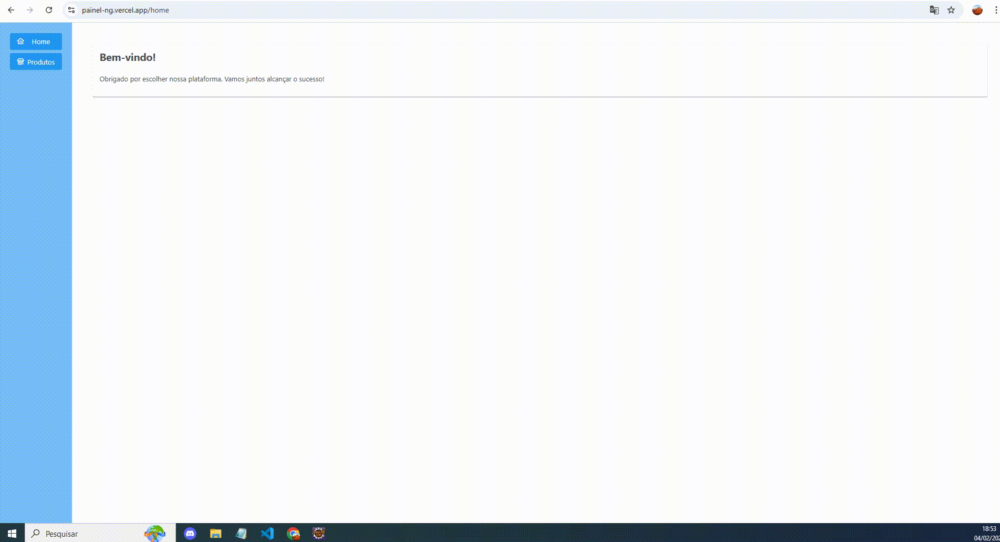

# E-Commerce Painel

Este projeto é um sistema de e-commerce para gerenciamento de produtos. O front-end é desenvolvido com Angular, enquanto o back-end é dividido em duas implementações equivalentes: uma utilizando Spring Boot e gerenciada pelo Tomcat, e outra desenvolvida sem Spring Boot, mas também gerenciada pelo WildFly. Embora tenha sido aplicado em casos específicos, o desenvolvimento também incluiu práticas de Test-Driven Development (TDD).

## Tecnologias Utilizadas

- **Front-end:** Angular
- **Back-end:** Java com Spring Boot
  - **Framework:** Spring Boot
  - **Web:** Spring MVC
  - **Persistência de Dados:** Spring Data JPA
  - **Banco de Dados:** H2 Database
- **Back-end:** Java Sem Spring Boot
   - **Servidor de Aplicação:** WildFly
   - **Persistência de Dados:** JPA
   - **APIs RESTful:** JAX-RS
   - **Conversão JSON:** Jackson
   - **Banco de Dados:** Oracle Database

## Requisitos

Antes de começar, certifique-se de ter os seguintes requisitos instalados:

- **Java JDK 17** ou superior
- **WildFly 26** ou superior
- **Node.js** (para o front-end)
- **Oracle Database** (configurado e acessível)

## Passos para Iniciar

### Back-end Spring Boot

1. **Instale o Java JDK.**
2. **Compile e execute o projeto Spring Boot:**
   - Navegue até o diretório do projeto.
   - Execute a classe principal `PainelSrvSpringApplication` para iniciar o servidor Spring Boot.

### Back-end WildFly

1. **Instale o Java JDK.**
2. **Configure o WildFly:**
   - Adicione a configuração do datasource no arquivo `standalone.xml`:

     ```xml
     <datasource jta="true" jndi-name="java:jboss/datasources/snDataSource" pool-name="snDataSource" enabled="true" use-java-context="true">
         <connection-url>jdbc:oracle:thin:@localhost:1521:orcl</connection-url>
         <driver>oracle</driver>
         <pool>
             <min-pool-size>1</min-pool-size>
             <max-pool-size>100</max-pool-size>
             <prefill>true</prefill>
         </pool>
         <security>
             <user-name>seuUser</user-name>
             <password>seuPassword</password>
         </security>
     </datasource>
     <drivers>
         <driver name="h2" module="com.h2database.h2">
             <xa-datasource-class>org.h2.jdbcx.JdbcDataSource</xa-datasource-class>
         </driver>
         <driver name="oracle" module="com.oracle">
             <driver-class>oracle.jdbc.driver.OracleDriver</driver-class>
         </driver>
     </drivers>
     ```

3. **Compile e desplogue o projeto no WildFly.**
4. **Configure o banco de dados:**
   Execute os seguintes comandos SQL para criar as sequências e tabelas necessárias:

   ```sql
   -- Sequência para Produto
   CREATE SEQUENCE produto_seq START WITH 1 INCREMENT BY 1 NOCACHE NOCYCLE;

   -- Sequência para ProdutoImagem
   CREATE SEQUENCE produto_imagem_seq START WITH 1 INCREMENT BY 1 NOCACHE NOCYCLE;

   -- Tabela Produto
   CREATE TABLE PRODUTO (
       ID            NUMBER(9) NOT NULL,
       DESCRICAO     VARCHAR2(250),
       PRECO_COMPRA  NUMBER(25, 16),
       PRECO_VENDA   NUMBER(25, 16),
       DATA_CADASTRO DATE
   ) LOGGING;

   -- Chave Primária na Tabela Produto
   ALTER TABLE PRODUTO ADD CONSTRAINT PRODUTO_PK PRIMARY KEY (ID);

   -- Tabela ProdutoImagem
   CREATE TABLE PRODUTO_IMAGEM (
       ID         NUMBER(9) NOT NULL,
       PRODUTO_ID NUMBER(9) NOT NULL,
       PRINCIPAL  NUMBER(1),
       URI_IMAGEM VARCHAR2(300)
   ) LOGGING;

   -- Chave Primária na Tabela ProdutoImagem
   ALTER TABLE PRODUTO_IMAGEM ADD CONSTRAINT PRODUTO_IMAGEM_PK PRIMARY KEY (ID, PRODUTO_ID);

   -- Chave Estrangeira na Tabela ProdutoImagem
   ALTER TABLE PRODUTO_IMAGEM
       ADD CONSTRAINT PRODUTO_FK FOREIGN KEY (PRODUTO_ID)
       REFERENCES PRODUTO (ID)
       NOT DEFERRABLE;

### Front-end
Instale as dependências e inicie o servidor de desenvolvimento:
 - npm install
 - ng start

## Apresentação
  -Front-end: https://painel-ng.vercel.app/product 
  -Back-end: https://painel-srv-spring-production.up.railway.app/painelsrv/api/products/all
 
